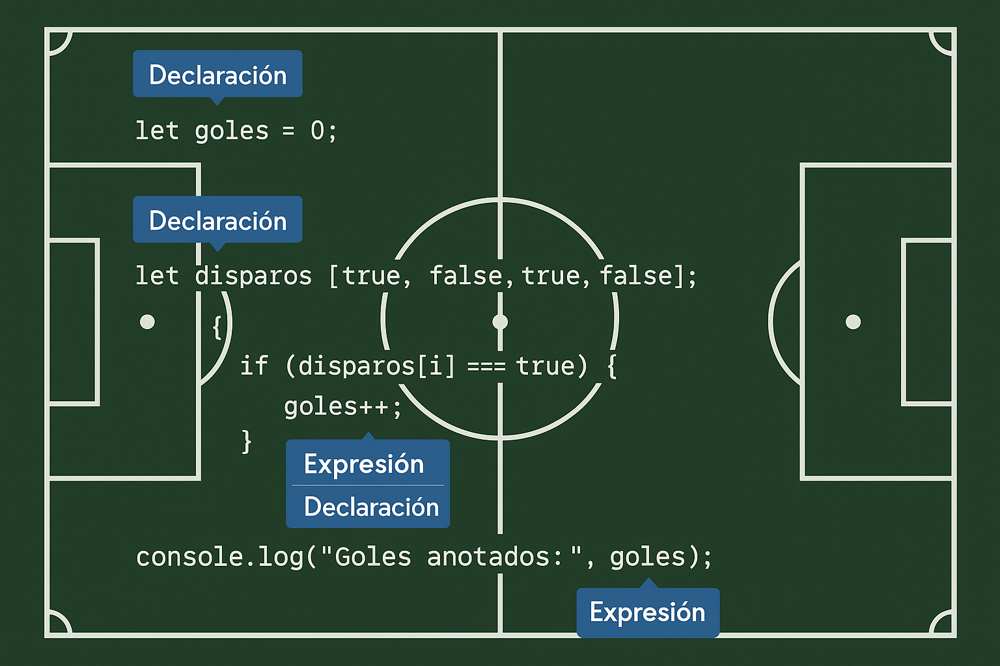

# Eloquent Javascript en español | Capítulo 2

## Expresiones y declaraciones

Imagina que estás en un partido de fútbol.

Una expresión en programación es como una jugada que produce un resultado, como un pase, un tiro o un gol.

Cuando escribes algo como 22 o "psicoanálisis", es como si un jugador simplemente patea el balón hacia el arco y mete un gol directo — ¡acción simple y con resultado inmediato!

Si usas paréntesis, es como una jugada preparada: un pase estratégico que organiza lo que va a pasar, pero sigue siendo una jugada que produce algo (como un pase clave que lleva al gol).

Si usas un operador binario (como 2 + 3), es como una pared entre dos jugadores: uno le pasa el balón al otro y, juntos, producen algo (el resultado de la suma, como un gol).

Un operador unario (como -5) es como un jugador que hace una jugada solo: cambia de dirección, hace un amague, y aun así genera una jugada útil.

Si una expresión es como una jugada que produce un resultado (como un pase o un gol), entonces una declaración (o statement en inglés) es como una instrucción del técnico o una estrategia del equipo.

Ejemplo:

```
let marcador = 0;
```

Esto es una declaración. No produce directamente un valor para usar como tal (como un gol o un pase), sino que establece una regla del juego o una condición: “el marcador empieza en 0”.

Ejemplo:

```
if (gol === true) {
  marcador++;
}
```

Eso también es una declaración. Es como decir:

“Si el delantero mete un gol, entonces subimos el marcador.”

**No estás generando un valor directamente (no es una jugada que produzca gol por sí misma), sino que estás dando instrucciones sobre cómo debe reaccionar el equipo ante una situación específica.**

Comparación rápida:
**Expresión:** Jugada que produce un resultado (valor). Ej: 22, "Messi", 2 + 2.

**Declaración:** Estrategia o instrucción del técnico que organiza cómo se juega.
Ej: let jugador = "Messi";, if (gol) { ... }.

```
let goles = 0; // Declaración
let disparos = [true, false, true, false]; // Declaración con una expresión (el arreglo)

for (let i = 0; i < disparos.length; i++) { // Declaración (bucle for)
  if (disparos[i] === true) { // Declaración (condicional) + expresión (disparos[i] === true)
    goles++; // Declaración (acción) + expresión (goles++)
  }
}
console.log("Goles anotados:", goles); // Declaración que muestra el resultado
```

### Explicación:

let goles = 0;: El técnico dice “empezamos el partido con cero goles”.

let disparos = [...]: El cuerpo técnico anota en una hoja si los disparos al arco fueron gol o no (true o false).

for (...): El técnico da la orden: “revisemos todos los disparos que hicimos”.

if (disparos[i] === true): “Si el disparo fue al arco y entró…”

goles++: “...sumamos un gol al marcador”. Aquí, goles++ es una expresión que incrementa y también es parte de una declaración que le dice al equipo qué hacer.

console.log(...): Al final del partido, el comentarista dice cuántos goles hiciste.

**Lo clave:**
**Las declaraciones** organizan cómo se juega: reglas, condiciones, bucles.

**Las expresiones** son las jugadas concretas que producen los valores: el disparo, el pase, el gol.



## Enlaces

¿Cómo mantiene un programa un estado interno? ¿Cómo recuerda las cosas? Hemos visto cómo producir nuevos valores a partir de valores antiguos, pero esto no cambia los valores antiguos, y el nuevo valor debe utilizarse inmediatamente o se disipará nuevamente. Para atrapar y retener valores, JavaScript proporciona una cosa llamada un enlace, o variable:

```
let caught = 5 * 5;
```

Debes imaginarte los enlaces como tentáculos en lugar de cajas. No contienen valores; los agarran—dos enlaces pueden hacer referencia al mismo valor. Un programa solo puede acceder a los valores a los que todavía tiene una referencia. Cuando necesitas recordar algo, o bien haces crecer un nuevo tentáculo para agarrarlo o lo reconectas con uno de tus tentáculos existentes.

Cuando defines un enlace sin darle un valor, el tentáculo no tiene nada que agarrar, por lo que termina en el aire. Si solicitas el valor de un enlace vacío, obtendrás el valor undefined.

La palabra const significa constante. Define un enlace constante, que apunta al mismo valor mientras exista. Esto es útil para enlaces que solo dan un nombre a un valor para poder referirse fácilmente a él más tarde.

### Nombres de enlaces

Los nombres de enlaces pueden ser cualquier secuencia de una o más letras.

Los dígitos pueden formar parte de los nombres de enlaces, catch22 es un nombre válido, por ejemplo, pero el nombre no puede empezar con un dígito. Un nombre de enlace puede incluir signos de dólar ($) o subrayados (\_), pero no otros signos de puntuación o caracteres especiales.

Palabras con un significado especial, como **let**, son palabra clave, y no pueden ser usadas como nombres de enlaces.

## El entorno

Un entorno en programación es la colección de nombres (enlaces) y sus correspondientes valores que existen en un momento específico durante la ejecución de un programa. Al iniciar un programa, este entorno ya contiene elementos predefinidos que son parte del lenguaje de programación. Además, con frecuencia incluye enlaces que permiten al programa interactuar con el sistema operativo o el entorno en el que se está ejecutando. Por ejemplo, en un navegador web, el entorno contendría funciones para manipular la página web actual y para recibir información del ratón y el teclado.

### Ejemplo

El entorno de un equipo de fútbol en un momento dado es como la alineación titular y el banquillo de suplentes disponibles justo antes de un partido.

Los enlaces serían los jugadores (cada uno con un nombre y una posición).
Los valores serían las habilidades y el rol que cada jugador tiene en ese momento (delantero goleador, defensa sólido, etc.).
Cuando empieza la temporada (el "programa se inicia"), el equipo ya tiene algunos jugadores fijos, las "estrellas" del club (parte del "lenguaje estándar" del equipo).

Pero además, el equipo tiene otros jugadores que le permiten interactuar con el "sistema circundante":

Jugadores con habilidades especiales para adaptarse a diferentes tácticas del rival.
Jugadores jóvenes que pueden aportar frescura en momentos clave.
Incluso podríamos pensar en el cuerpo técnico como parte del entorno, con sus estrategias para influir en el juego.
Así, el entorno futbolístico en un instante específico es la combinación de todos los jugadores disponibles y sus capacidades para afrontar el partido.

## Funciones

Imagina una función como una receta de cocina escrita en un papel.

El papel con la receta es el "valor" que contiene las instrucciones.

Las instrucciones escritas son el "fragmento de programa envuelto".

Aplicar la función sería como seguir los pasos de la receta para cocinar el plato.
Tú tienes el papel con la receta (el valor de la función), y cuando decides usarla (aplicarla), sigues las instrucciones para obtener un resultado (ejecutar el programa envuelto).

Puedes tener muchas recetas diferentes (muchas funciones) para hacer diferentes platos (ejecutar diferentes fragmentos de programa).

Ejecutar una función se llama invocar, llamar, o aplicar la función. Puedes llamar una función poniendo paréntesis después de una expresión que produce un valor de función.

Los valores dados a las funciones se llaman argumentos. Diferentes funciones pueden necesitar un número diferente o diferentes tipos de argumentos.

## Valores de retorno

Muchas funciones son útiles debido a los efectos secundarios que producen. Las funciones también pueden producir valores, en cuyo caso no necesitan tener un efecto secundario para ser útiles. Por ejemplo, la función Math.max toma cualquier cantidad de argumentos numéricos y devuelve el mayor:

```
console.log(Math.max(2, 4));
// → 4
```

Cuando una función produce un valor, se dice que retorna ese valor.

## Control de flujo

Cuando tu programa contiene más de una sentencia, las sentencias se ejecutan como si fueran una historia, de arriba hacia abajo. Por ejemplo, el siguiente programa tiene dos sentencias. La primera le pide al usuario un número, y la segunda, que se ejecuta después de la primera, muestra el cuadrado de ese número:

```
let elNumero = Number(prompt("Elige un número"));
console.log("Tu número es la raíz cuadrada de " + elNumero * elNumero);
```

### Ejecución condicional

No todos los programas son caminos rectos. Podríamos, por ejemplo, querer crear una carretera ramificada donde el programa tome la rama adecuada basada en la situación en cuestión. Esto se llama ejecución condicional.


La ejecución condicional se crea con la palabra clave if en JavaScript. En el caso simple, queremos que cierto código se ejecute si, y solo si, una cierta condición es verdadera.

La palabra clave if ejecuta o salta una sentencia dependiendo del valor de una expresión booleana. La expresión de decisión se escribe después de la palabra clave, entre paréntesis, seguida de la sentencia a ejecutar.

La sentencia después del if está envuelta entre llaves ({ y }) en este ejemplo.

Las llaves se pueden usar para agrupar cualquier cantidad de sentencias en una sola sentencia, llamada un bloque.

A menudo no solo tendrás código que se ejecuta cuando una condición es verdadera, sino también código que maneja el otro caso. Esta ruta alternativa está representada por la segunda flecha en el diagrama. Puedes usar la palabra clave else, junto con if, para crear dos caminos de ejecución alternativos y separados:

```
let elNumero = Number(prompt("Elige un número"));
if (!Number.isNaN(elNumero)) {
  console.log("Tu número es la raíz cuadrada de " +
              elNumero * elNumero);
} else {
  console.log("Oye. ¿Por qué no me diste un número?");
}
```

Si tienes más de dos caminos para elegir, puedes “encadenar” múltiples pares if/else. Aquí tienes un ejemplo:

```
let num = Number(prompt("Escoge un número"));

if (num < 10) {
  console.log("Pequeño");
} else if (num < 100) {
  console.log("Mediano");
} else {
  console.log("Grande");
}
```
### Bucles 

#### while y do

El control de flujo mediante bucles nos permite regresar a algún punto en el programa donde estábamos antes y repetirlo con nuestro estado de programa actual. Si combinamos esto con una variable que cuente, podemos hacer algo como esto:

```
let numero = 0;
while (numero <= 12) {
  console.log(numero);
  numero = numero + 2;
}
// → 0
// → 2
//   … etcétera
```

Una sentencia que comienza con la palabra clave while crea un bucle. La palabra while va seguida de una expresión entre paréntesis y luego un enunciado, similar a if. El bucle sigue ejecutando ese enunciado mientras la expresión produzca un valor que se convierta en true al convertirse a Booleano.

```
let result = 1;
let counter = 0;
while (counter < 10) {
  result = result * 2;
  counter = counter + 1;
}
console.log(result);
// → 1024
```


Un bucle do es una estructura de control similar a un bucle while. La única diferencia radica en que un bucle do siempre ejecuta su cuerpo al menos una vez, y comienza a probar si debe detenerse solo después de esa primera ejecución.

```
let tuNombre;
do {
  tuNombre = prompt("¿Quién eres?");
} while (!tuNombre);
console.log("Hola " + tuNombre);
```

Este programa te obligará a ingresar un nombre. Preguntará una y otra vez hasta que obtenga algo que no sea una cadena vacía. Aplicar el operador ! convertirá un valor al tipo Booleano antes de negarlo, y todas las cadenas excepto "" se convierten en true. Esto significa que el bucle continúa hasta que proporciones un nombre no vacío.

#### bucles for

Muchos bucles siguen el patrón mostrado en los ejemplos de while. Primero se crea una variable de “contador” para rastrear el progreso del bucle. Luego viene un bucle while, generalmente con una expresión de prueba que verifica si el contador ha alcanzado su valor final. Al final del cuerpo del bucle, el contador se actualiza para rastrear el progreso.

Debido a que este patrón es tan común, JavaScript y lenguajes similares proporcionan una forma ligeramente más corta y completa, el bucle for:

```
for (let numero = 0; numero <= 12; numero = numero + 2) {
  console.log(numero);
}
// → 0
// → 2
//   … etcétera
```

Los paréntesis después de la palabra clave for deben contener dos punto y coma. La parte antes del primer punto y coma inicializa el bucle, generalmente definiendo una variable. La segunda parte es la expresión que verifica si el bucle debe continuar. La parte final actualiza el estado del bucle después de cada iteración. En la mayoría de los casos, esto es más corto y claro que un while tradicional.

```
for (let numero = 0; numero <= 12; numero = numero + 2) {
  console.log(numero);
}
```

Los paréntesis después de la palabra clave for deben contener dos punto y coma. La parte antes del primer punto y coma inicializa el bucle, generalmente definiendo una variable. La segunda parte es la expresión que verifica si el bucle debe continuar. La parte final actualiza el estado del bucle después de cada iteración. En la mayoría de los casos, esto es más corto y claro que un while tradicional.

Hacer que la condición del bucle produzca false no es la única forma en que un bucle puede terminar. La instrucción break tiene el efecto de salir inmediatamente del bucle que la contiene. Su uso se demuestra en el siguiente programa, que encuentra el primer número que es mayor o igual a 20 y divisible por 7:

```
for (let actual = 20; ; actual = actual + 1) {
  if (actual % 7 == 0) {
    console.log(actual);
    break;
  }
}
// → 21
```

Usar el operador de resto (%) es una forma sencilla de comprobar si un número es divisible por otro. Si lo es, el resto de su división es cero.

La palabra clave continue es similar a break en que influye en el progreso de un bucle. Cuando se encuentra continue en el cuerpo de un bucle, el control salta fuera del cuerpo y continúa con la siguiente iteración del bucle.

## Sangrado (Indentación) de Código

El papel de este sangrado dentro de los bloques es hacer que la estructura del código resalte para los lectores humanos.

Con un sangrado adecuado, la forma visual de un programa corresponde a la forma de los bloques dentro de él.


## Actualización concisa de enlaces (variable)

Especialmente al hacer bucles, un programa a menudo necesita “actualizar” un enlace para que contenga un valor basado en el valor anterior de ese enlace.

```
counter = counter + 1;

JavaScript proporciona un atajo para esto:

counter += 1;
result *= 2
counter -= 1
```

Existen equivalente aún más cortos.

```
let counter = 0 // Declaración

counter++ // Expresión (cuando la declaración realiza una acción)
counter--
```

## Despachar un valor con switch

```
if (x == "valor1") accion1();
else if (x == "valor2") accion2();
else if (x == "valor3") accion3();
else accionPredeterminada();
```

Existe una construcción llamada switch que está destinada a expresar dicho “despacho” de una manera más directa. Desafortunadamente, la sintaxis que JavaScript utiliza para esto (heredada de la línea de lenguajes de programación C/Java) es algo incómoda; una cadena de declaraciones if puede verse mejor. Aquí hay un ejemplo:


```
switch (prompt("¿Cómo está el clima?")) {
  case "lluvioso":
    console.log("Recuerda llevar un paraguas.");
    break;
  case "soleado":
    console.log("Vístete ligero.");
  case "nublado":
    console.log("Sal al exterior.");
    break;
  default:
    console.log("¡Tipo de clima desconocido!");
    break;
}
```

Puedes colocar cualquier cantidad de etiquetas case dentro del bloque abierto por switch. El programa comenzará a ejecutarse en la etiqueta que corresponda al valor que se le dio a switch, o en default si no se encuentra ningún valor coincidente. Continuará ejecutándose, incluso a través de otras etiquetas, hasta que alcance una declaración break. En algunos casos, como el caso "soleado" en el ejemplo, esto se puede usar para compartir algo de código entre casos (recomienda salir al exterior tanto para el clima soleado como para el nublado). Sin embargo, ten cuidado, es fácil olvidar un break de este tipo, lo que hará que el programa ejecute código que no deseas ejecutar.

## Uso de mayúsculas

Los nombres de los enlaces no pueden contener espacios, sin embargo, a menudo es útil usar varias palabras para describir claramente lo que representa el enlace.

Ejemplos:

```
fuzzylittleturtle // Lower case
fuzzy_little_turtle // Snake case
FuzzyLittleTurtle // Pascal Case
fuzzyLittleTurtle // Camel Case
```
Las funciones estándar de JavaScript y la mayoría de los programadores de JavaScript siguen el último estilo


## Comentarios

Un comentario es un fragmento de texto que forma parte de un programa pero que es completamente ignorado por la computadora. JavaScript tiene dos formas de escribir comentarios. Para escribir un comentario de una sola línea, puedes usar dos caracteres de barra (//)

Una sección de texto entre /* y */ será ignorada por completo, independientemente de si contiene saltos de línea. Esto es útil para agregar bloques de información sobre un archivo o un fragmento de programa:
