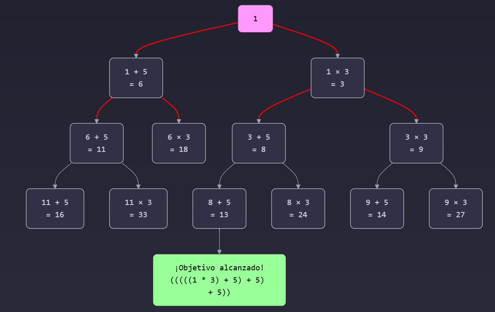

# Eloquent Javascript en español | Capítulo 3

## Funciones

La gente piensa que la informática es el arte de los genios, pero la realidad actual es la opuesta, simplemente muchas personas haciendo cosas que se construyen unas sobre otras, como un muro de mini piedras

Una función se crea con una expresión que comienza con la palabra clave function. Las funciones tienen un conjunto de parámetros (en este caso, solo x) y un cuerpo, que contiene las declaraciones que se ejecutarán cuando se llame a la función. El cuerpo de una función creada de esta manera siempre debe estar envuelto entre llaves, incluso cuando consiste en una única declaración.

```
const roundTo = function(n, step) {
  let resto = n % step;
  return n - resto + (resto < step / 2 ? 0 : step);
};
```

⚽ Explicación en contexto futbolístico
Imagina que estás entrenando a un jugador para que patee la pelota hacia el arco desde distintas distancias, pero siempre debe posicionarse en una marca que está pintada cada ciertos metros (por ejemplo, cada 5 metros).

n es la posición actual del jugador, quizás se detuvo en el metro 7.

step es la distancia entre marcas en la cancha (5 metros).

La función decide:
→ ¿Debe el jugador retroceder a la marca anterior (metro 5)?
→ ¿O avanzar a la siguiente marca (metro 10)?

La decisión se toma según qué tan cerca está de cada marca:

Si el jugador está más cerca de la marca anterior, se queda ahí.

Si está más cerca de la siguiente marca, avanza hacia ella.

💡 Ejemplo en la cancha:

Si el jugador está en el metro 7:

Más cerca del 5 → se ubica en el 5.

Si está en el metro 8:

Más cerca del 10 → se ubica en el 10.

Así, el entrenador siempre sabe en qué punto fijo entrenar al jugador, sin importar dónde se haya detenido.

### Return

Cuando el control llega a una instrucción de ese tipo, salta inmediatamente fuera de la función actual y le da el valor devuelto al código que llamó a la función. Una palabra clave return sin una expresión después de ella hará que la función devuelva **undefined**. Las funciones que no tienen ninguna instrucción return en absoluto, como makeNoise, devuelven igualmente **undefined.**

Los parámetros de una función se comportan como enlaces habituales, pero sus valores iniciales son dados por el llamador de la función, no por el código en la función en sí misma

### Enlaces y ámbitos (variables y alcance)

Cada variable tiene un alcance, que es la parte del programa en la que la variable es visible (usable).
Para las variables definidas fuera de cualquier función, bloque o módulo, el ámbito (alcance) es todo el programa, puedes hacer referencia a esos enlaces (variables) donde quieras, esto se conoce actualmente como scope.

Imaginemos que:

Un ámbito (scope) es como una zona del campo o del estadio.

Una variable es como un jugador con un nombre específico (por ejemplo, "n").

Cuando un jugador (variable) está en una zona interna (como una función), puede ver a los jugadores que están en zonas externas, a menos que ya haya un jugador con el mismo nombre en su zona.

⚽ Traducción futbolística del concepto de ámbito
Imaginemos que:

Un ámbito (scope) es como una zona del campo o del estadio.

Una variable es como un jugador con un nombre específico (por ejemplo, "n").

Cuando un jugador (variable) está en una zona interna (como una función), puede ver a los jugadores que están en zonas externas, a menos que ya haya un jugador con el mismo nombre en su zona.

🏟️ “Mirar hacia afuera”:
Si estás en la zona de entrenamiento de delanteros (un bloque o función), puedes ver a los entrenadores o reglas del campo más general (ámbito global).
Eso es como cuando una función puede acceder a variables globales o de ámbitos exteriores.

```
let n = 10;

function verNumero() {
  console.log(n); // Ve el "n" global: 10
}
👉 Aquí, el jugador en la zona de entrenamiento mira hacia la tribuna y ve el cartel que dice "n = 10".
```

🧍‍♂️🧍‍♂️ Cuando hay dos jugadores con el mismo nombre ("n")
Ahora imagina que en la zona interna hay otro jugador también llamado "n". El entrenador interno solo ve a su propio "n", no al de afuera.

```
let n = 10;

function halve(n) {
  return n / 2;
}
Cuando halve(4) se ejecuta:

El entrenador (función) está trabajando con su propio jugador llamado "n" (que vale 4).

No le importa el "n" del estadio principal (que vale 10), porque tiene uno con el mismo nombre dentro de su grupo.
```

🏟️ Metáfora:

Si en la cancha principal hay un jugador llamado “n” con camiseta #10, pero en la zona de penales (una función) hay otro “n” con camiseta #4, el DT de penales solo va a ver al que tiene en su área. El otro queda invisible para él, aunque esté en el estadio.

🧠 Conclusión futbolística
Las zonas internas (funciones o bloques) pueden ver hacia afuera y usar jugadores (variables) que estén en zonas superiores.

Pero si dentro tienen un jugador con el mismo nombre, solo entrenan con ese y ignoran al resto, aunque estén más arriba.

### Ámbito anidado

Bloques y funciones pueden ser creados dentro de otros bloques y funciones, produciendo múltiples grados de localidad.

```
function zonaMedia() {
  let global = "Estadio";

function zonaMedia() {
  let medio = "Mitad de la cancha";

  function zonaAtaque() {
    let ataque = "Área de gol";
    console.log(global); // ✅ Estadio
    console.log(medio);  // ✅ Mitad de la cancha
    console.log(ataque); // ✅ Área de gol
  }

  zonaAtaque();
}
```

🧠 Aquí:

zonaAtaque() puede ver todo porque está escrita dentro de zonaMedia(), y ambas están en el bloque global.

Todo esto es léxico: no depende de cómo se llame la función, sino de cómo está organizada en el código fuente.

### Notación de declaración

🧠 Tipos de funciones en JavaScript
En JavaScript hay varias formas de definir funciones. Las más comunes son:

Declaración de función (Function Declaration)

Expresión de función (Function Expression)

Funciones flecha (Arrow Functions)

Funciones anónimas

Funciones como métodos en objetos

Funciones constructoras

Funciones de orden superior

⚽ Explicación futbolística: Cristiano como jugador versátil
Imaginemos que Cristiano Ronaldo no solo es un jugador, sino un tipo de jugador con distintos roles, formas de entrar al partido o ser llamado por el entrenador.
Cada tipo de función en JavaScript representa una forma diferente de tener a Cristiano en la cancha (tu código).

1. 🧾 Declaración de función
   js
   Copiar
   Editar
   function cristiano() {
   console.log("Cristiano mete un gol de cabeza");
   }
   🗣️ Fútbol: Es como cuando Cristiano está desde el inicio del partido, titular confirmado en la nómina. El entrenador (el motor de JavaScript) lo reconoce desde el calentamiento.

✅ Ventaja: Puedes llamarlo incluso antes de haberlo escrito en el código, gracias al hoisting.

js
Copiar
Editar
cristiano(); // Funciona aunque esté definido más abajo 2. 💼 Expresión de función
js
Copiar
Editar
const cristiano = function() {
console.log("Cristiano hace una bicicleta");
};
🗣️ Fútbol: Cristiano es suplente, pero está listo en la banca y puede entrar cuando se le asigne la camiseta (cuando se ejecute esa línea de código).

❌ No puedes usarlo antes de definirlo.

js
Copiar
Editar
cristiano(); // ❌ Error si lo llamas antes de esta línea 3. 🏹 Arrow function (función flecha)
js
Copiar
Editar
const cristiano = () => {
console.log("Cristiano hace un gol de tiro libre");
};
🗣️ Fútbol: Es Cristiano versión rápida y directa, ideal para jugadas rápidas. No tiene su propio “contexto” (no tiene su propio this, como si no usara su vestuario, sino el de su equipo).

✅ Más corta, pero no apta para todo tipo de jugadas complejas (por ejemplo, no puede usar this como otras funciones).

4. 🎭 Función anónima
   js
   Copiar
   Editar
   setTimeout(function() {
   console.log("Cristiano aparece en el minuto 90");
   }, 2000);
   🗣️ Fútbol: Cristiano entra sin nombre, como un jugador sorpresa en una jugada específica. No lo puedes llamar directamente, pero ejecuta una acción en un momento preciso.

5. 🧱 Función como método de un objeto
   js
   Copiar
   Editar
   const jugador = {
   nombre: "Cristiano",
   celebrar: function() {
   console.log("SiiiUUUUU");
   }
   };
   🗣️ Fútbol: Cristiano forma parte de un equipo (objeto), y tiene un rol específico, como “celebrar un gol”.

js
Copiar
Editar
jugador.celebrar(); // SiiiUUUUU 6. 🏗️ Función constructora
js
Copiar
Editar
function Jugador(nombre) {
this.nombre = nombre;
this.saludar = function() {
console.log("Hola, soy " + this.nombre);
};
}

const cristiano = new Jugador("Cristiano Ronaldo");
cristiano.saludar(); // Hola, soy Cristiano Ronaldo
🗣️ Fútbol: Es como un modelo de jugador, un molde para crear muchos “Cristianos” personalizados (versión Manchester, versión Madrid, versión Al-Nassr).

7. 🧠 Funciones de orden superior
   js
   Copiar
   Editar
   function ejecutarJugada(jugador) {
   jugador();
   }

ejecutarJugada(() => {
console.log("Cristiano hace un sombrero");
});
🗣️ Fútbol: Es como un entrenador que le da instrucciones a Cristiano. La función no juega, pero dirige a otras funciones (jugadores) sobre qué hacer.

✅ Resumen tipo tabla
Tipo de función Explicación técnica Cristiano en fútbol
Declaración de función Visible antes de ejecutarse (hoisting) Titular desde el inicio del partido
Expresión de función Solo existe después de definirse Suplente que entra al recibir la camiseta
Arrow function Más corta, sin this propio Cristiano rápido y directo, no entra al vestuario
Función anónima Sin nombre, usada en el momento Cristiano entra como sorpresa en una jugada
Función como método Parte de un objeto Cristiano celebrando en nombre del equipo
Función constructora Plantilla para crear objetos Fábrica de versiones de Cristiano
Función de orden superior Recibe o devuelve funciones El DT que arma jugadas con Cristiano

¿Quieres que te haga un mini juego de fútbol en código con estas funciones? Podríamos simular pases, tiros y celebraciones entre "jugadores" (funciones).

#### Funciones de flecha

En lugar de la palabra clave function, utiliza una flecha (=>).
La flecha viene después de la lista de parámetros y es seguida por el cuerpo de la función. Expresa algo así como “esta entrada (los parámetros) produce este resultado (el cuerpo)”.

Cuando solo hay un nombre de parámetro, puedes omitir los paréntesis alrededor de la lista de parámetros. Si el cuerpo es una sola expresión, en lugar de un bloque entre llaves, esa expresión será devuelta por la función. Por lo tanto, estas dos definiciones de exponente hacen lo mismo:

```
const exponente1 = (x) => { return x * x; };
const exponente2 = x => x * x;
```

```
const cuerno = () => {
  console.log("Toot");
};
```

| Tipo de función          | ¿Tiene hoisting completo? | ¿Puedes llamarla antes de definirla? |
| ------------------------ | ------------------------- | ------------------------------------ |
| Declaración (`function`) | ✅ Sí                     | ✅ Sí                                |
| Arrow function (`const`) | ❌ No                     | ❌ No                                |
| Function expression      | ❌ No                     | ❌ No                                |

#### Pila de llamadas (Callstack)

Dado que una función tiene que regresar al lugar que la llamó cuando termina, la computadora debe recordar el contexto desde el cual se realizó la llamada. En un caso, console.log tiene que regresar a la función saludar cuando haya terminado. En el otro caso, regresa al final del programa.

El lugar donde la computadora almacena este contexto es la pila de llamadas. Cada vez que se llama a una función, el contexto actual se almacena en la parte superior de esta pila. Cuando una función devuelve, elimina el contexto superior de la pila y usa ese contexto para continuar la ejecución.

Cuando la pila crece demasiado, la computadora fallará con un mensaje como “sin espacio en la pila” o “demasiada recursividad”.  O más bien, sería infinito, si la computadora tuviera una pila infinita. Como no la tiene, nos quedaremos sin espacio o “reventaremos la pila”.

Imagina que estás jugando un partido de fútbol y cada acción que realizas es como una función en nuestro programa. Veamos cómo funciona:

1
Estado Base (Campo Vacío)
Es como el campo antes del partido
No hay jugadores en el campo
Representa el estado inicial del programa

2
Primera Acción (Entrada al Campo)
Cuando entras al campo (llamada a saludar("Harry"))
Es como cuando sales del vestuario al campo
Tu posición anterior (el vestuario) se guarda temporalmente

3
Acciones Secundarias (Jugadas)
Cuando realizas una acción dentro del campo (llamada a console.log)
Es como cuando pasas el balón a un compañero
Tu posición actual en la jugada se guarda

4
Retorno (Regreso a Posiciones)
Después de cada acción, vuelves a tu posición anterior
Como cuando termina una jugada y regresas a tu posición
Cada jugador debe saber dónde estaba antes
Ejemplo Paso a Paso
Veamos cómo fluye el juego (el programa):

function saludar(quien) {
console.log("Hola " + quien);
}
saludar("Harry");
console.log("Adiós");
Flujo del partido:

Estado inicial (campo vacío)
Ningún jugador en el campo
Programa esperando instrucciones
Primera jugada (entrada al campo)
Jugador entra al campo (saludar("Harry"))
Guarda su posición anterior (vestuario)
Acción dentro del campo
Pasa el balón al portero (console.log)
Portero recibe y guarda el balón
Regresa el balón al jugador
Fin de la primera jugada
Jugador regresa al vestuario
Campo vuelve a estar vacío temporalmente
Última jugada
Nuevo jugador entra (segundo console.log)
Realiza su acción ("Adiós")
Termina el partido
Importante Recordar
La Pila de Llamadas es como el Árbitro
Recuerda todas las posiciones
Asegura que cada jugador regrese a su lugar correcto
Mantiene el orden del juego
El Espacio en la Memoria
Como un estadio tiene capacidad limitada
Si demasiados jugadores están en el campo simultáneamente
Se produce un error ("sin espacio en la pila")
La Recursividad
Es como cuando los jugadores se pasan el balón infinitamente
Sin una condición para parar, el estadio se llenaría
Eventualmente causaría un error
Esta analogía del fútbol te ayudará a entender mejor cómo las funciones se llaman unas a otras y cómo la computadora mantiene registro de dónde debe volver después de cada llamada. ¡Es como dirigir un equipo donde cada jugador debe saber exactamente cuándo y dónde debe moverse!

#### Argumentos Opcionales

Argumentos Opcionales
El siguiente código está permitido y se ejecuta sin ningún problema:

```
function square(x) { return x * x; }
console.log(square(4, true, "erizo"));
// → 16
```

Hemos definido square con solo un parámetro. Sin embargo, cuando lo llamamos con tres, el lenguaje no se queja. Ignora los argumentos adicionales y calcula el cuadrado del primero.

JavaScript es extremadamente flexible en cuanto al número de argumentos que puedes pasar a una función. Si pasas demasiados, los extras son ignorados. Si pasas muy pocos, los parámetros faltantes se les asigna el valor undefined.

#### Clausura

La capacidad de tratar las funciones como valores, combinada con el hecho de que los enlaces locales se recrean cada vez que se llama a una función, plantea una pregunta interesante: ¿qué sucede con los enlaces locales cuando la llamada a la función que los creó ya no está activa?El siguiente código muestra un ejemplo de esto. Define una función, wrapValue, que crea un enlace local. Luego devuelve una función que accede a este enlace local y lo devuelve:


```
function wrapValue(n) {
  let local = n;
  return () => local;
}

let wrap1 = wrapValue(1);
let wrap2 = wrapValue(2);
console.log(wrap1());
// → 1
console.log(wrap2());
// → 2
```

Esto está permitido y funciona como esperarías: ambas instancias del enlace aún pueden accederse. Esta situación es una buena demostración de que los enlaces locales se crean nuevamente para cada llamada, y las diferentes llamadas no afectan los enlaces locales de los demás.

#### Recursión

Es perfectamente válido que una función se llame a sí misma, siempre y cuando no lo haga tan a menudo que desborde la pila. Una función que se llama a sí misma se llama recursiva. La recursión permite que algunas funciones se escriban de una manera diferente. Toma, por ejemplo, esta función power, que hace lo mismo que el operador ** (potenciación):

```
function power(base, exponent) {
  if (exponent == 0) {
    return 1;
  } else {
    return base * power(base, exponent - 1);
  }
}

console.log(power(2, 3));
// → 8
```
Sin embargo, esta implementación tiene un problema: en implementaciones típicas de JavaScript, es aproximadamente tres veces más lenta que una versión que utiliza un bucle for. Recorrer un simple bucle suele ser más económico que llamar a una función múltiples veces.


### TEST

Considera este rompecabezas: al comenzar desde el número 1 y repetidamente sumar 5 o multiplicar por 3, se puede producir un conjunto infinito de números. ¿Cómo escribirías una función que, dado un número, intente encontrar una secuencia de tales sumas y multiplicaciones que produzcan ese número? Por ejemplo, el número 13 podría alcanzarse al multiplicar por 3 y luego sumar 5 dos veces, mientras que el número 15 no podría alcanzarse en absoluto.



En el diagrama anterior:

El nodo rosa representa el punto de partida (1)
Las flechas rojas indican el camino correcto hacia la solución
Cada nodo muestra tanto el valor actual como la operación realizada
Las ramas que superan el objetivo (13) se cortan automáticamente

La función utiliza dos técnicas importantes:

Backtracking: Cuando encuentra un camino que no lleva a la solución (como 18 o 24), retrocede y prueba otras alternativas
Operador nullish coalescing (??): Prueba la primera opción (+5), y solo si esa opción devuelve null, prueba la segunda opción (*3)
Este proceso continúa hasta que encuentra una secuencia de operaciones que llegue exactamente al objetivo (13), o hasta que agota todas las posibilidades sin encontrar una solución.

#### Crecimiento de funciones

Hay dos formas más o menos naturales de introducir funciones en los programas.

La primera ocurre cuando te encuentras escribiendo código similar varias veces. Preferirías no hacer eso, ya que tener más código significa más espacio para que se escondan los errores y más material para que las personas que intentan entender el programa lo lean. Por lo tanto, tomas la funcionalidad repetida, encuentras un buen nombre para ella y la colocas en una función.

La segunda forma es que te das cuenta de que necesitas alguna funcionalidad que aún no has escrito y que suena como si mereciera su propia función. Comienzas por nombrar la función, luego escribes su cuerpo. Incluso podrías comenzar a escribir código que use la función antes de definir la función en sí.

Lo difícil que es encontrar un buen nombre para una función es una buena indicación de lo claro que es el concepto que estás tratando de envolver con ella. Vamos a través de un ejemplo.

#### Funciones y efectos secundarios

Las funciones pueden dividirse aproximadamente en aquellas que se llaman por sus efectos secundarios y aquellas que se llaman por su valor de retorno (aunque también es posible tener efectos secundarios y devolver un valor).

La primera función auxiliar en el ejemplo de la granja, imprimirConRellenoYEtiqueta, se llama por su efecto secundario: imprime una línea. La segunda versión, rellenarConCeros, se llama por su valor de retorno. No es casualidad que la segunda sea útil en más situaciones que la primera. Las funciones que crean valores son más fáciles de combinar de nuevas formas que las funciones que realizan efectos secundarios directamente.

Una función pura es un tipo específico de función productora de valor que no solo no tiene efectos secundarios, sino que tampoco depende de efectos secundarios de otro código, por ejemplo, no lee enlaces globales cuyo valor podría cambiar. Una función pura tiene la agradable propiedad de que, al llamarla con los mismos argumentos, siempre produce el mismo valor (y no hace nada más). Una llamada a tal función puede sustituirse por su valor de retorno sin cambiar el significado del código. Cuando no estás seguro de si una función pura está funcionando correctamente, puedes probarla llamándola y saber que si funciona en ese contexto, funcionará en cualquier otro. Las funciones no puras tienden a requerir más andamiaje para probarlas.

### Resumen 

Este capítulo te enseñó cómo escribir tus propias funciones. La palabra clave function, cuando se usa como expresión, puede crear un valor de función. Cuando se usa como una declaración, puede usarse para declarar un enlace y darle una función como su valor. Las funciones de flecha son otra forma de crear funciones.


```
// Definir f para contener un valor de función
const f = function(a) {
  console.log(a + 2);
};

// Declarar g como una función
function g(a, b) {
  return a * b * 3.5;
}

// Un valor de función menos verboso
let h = a => a % 3;
```

Una parte clave para entender las funciones es comprender los ámbitos (scopes). Cada bloque crea un nuevo ámbito. Los parámetros y los enlaces declarados en un ámbito dado son locales y no son visibles desde el exterior. Los enlaces declarados con var se comportan de manera diferente: terminan en el ámbito de la función más cercana o en el ámbito global.

Separar las tareas que realiza tu programa en diferentes funciones es útil. No tendrás que repetirte tanto, y las funciones pueden ayudar a organizar un programa agrupando el código en piezas que hacen cosas específicas.